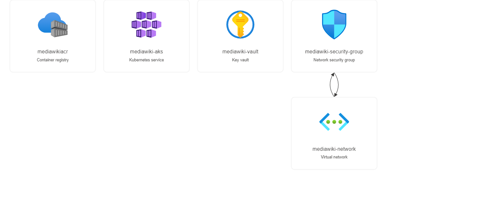

# mediawiki
## Very first step will be craete a Azure AD App registration 
## All the credetial will applied via enviroment variable in IDE such as 
 - $env:ARM_CLIENT_ID
 - $env:ARM_CLIENT_SECRET
 - $env:ARM_TENANT_ID
 - $env:ARM_SUBSCRIP TION_ID
 
## There are two section in it first section is for basic infra which will have code for 
 - Resource Group
 - Virtual Network
 - Azure Keyvault
 - Azure container registry
 - Azure Kubernetes Cluster
## Snap

## Second Section is for 
 - CI/CD for Docker Application with Databases

## How to run the automation
